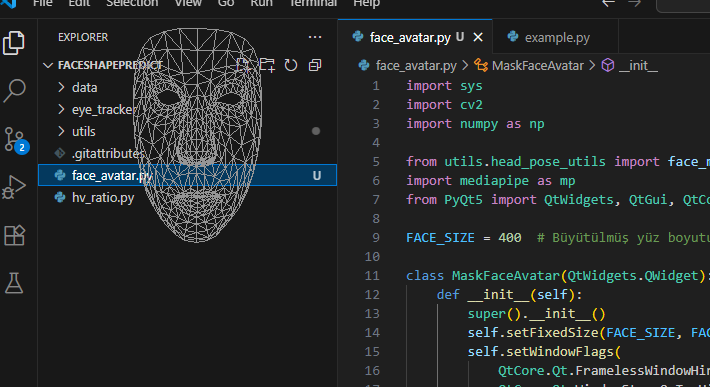

# 🧠 FaceShapePredict

Bu proje, **kameradan alınan yüz verilerini işleyerek gerçek zamanlı yüz şekli izleme ve maske tabanlı yüz animasyonu** gerçekleştiren bir sistemdir. Yüz hareketleri ekranın sol üst köşesinde şeffaf bir pencere içerisinde, 3D mesh olarak gösterilir.

## 🖼️ Örnek Görüntü



## 🚀 Özellikler

- 📷 Kameradan alınan yüz landmark verilerini işler (MediaPipe FaceMesh)
- 🧑‍🎨 PyQt5 ile masaüstü üzerinde şeffaf, dairesel bir yüz maskesi oluşturur
- 🎭 Nokta yerine gerçekçi yüz çizimi (wireframe/mesh tarzı)
- 🎯 Kafa hareketlerini senkronize olarak takip eder
- 🖥️ Arka plan tamamen saydamdır, yalnızca yüz görünür

## 🛠️ Kullanılan Teknolojiler

- Python 3.8+
- [MediaPipe](https://google.github.io/mediapipe/)
- PyQt5
- OpenCV

## ⚙️ Kurulum

```bash
git clone https://github.com/erdokrmn/FaceShapePredict.git
cd FaceShapePredict
pip install -r requirements.txt
